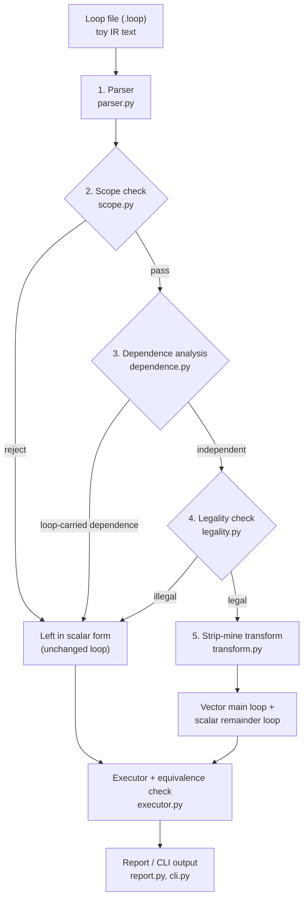

# Auto-Vectorizing Loop Optimizer

A small, self-contained **IR-to-IR auto-vectorizing loop optimizer** for
Compiler Design (BCSE307). It demonstrates the core vectorization pipeline on
a simplified *toy IR* instead of full LLVM IR, so that each stage can be read,
run and tested on its own.

Given a counted loop written in a tiny text format, the tool:

1. parses it into a toy-IR loop object,
2. checks it is inside the supported shape,
3. decides whether its array accesses contain a **loop-carried dependence**
   using a simplified GCD / Banerjee-style offset comparison,
4. checks a set of **legality preconditions**,
5. if both checks pass, **strip-mines** the loop into a vector main loop plus a
   scalar remainder loop (emitted as `VLOAD` / `VADD` / `VSTORE`-style
   pseudo-operations); otherwise the loop is left in scalar form.

No real SIMD instructions are generated or executed — the output is toy IR. The
results are checked by an interpreter that runs the original and transformed
loops on identical inputs and compares them.

## Quick start

```bash
# install (uv manages the virtualenv and dev tools)
uv sync

# run the tool on an example loop
uv run avlo examples/saxpy.loop

# machine-readable output
uv run avlo --json examples/recurrence.loop

# execute the scalar and vectorized forms and check they agree
uv run avlo --verify examples/saxpy.loop

# run the test suite
uv run pytest
```

`uv run python -m avlo examples/copy.loop` works too.

## The toy IR text format

```text
# comments start with '#'
vector_width 4                # optional; defaults to 4

loop i = 0 to 100             # iterations are start .. end-1 (trip count = 100)
    y[i] = alpha * x[i] + y[i]
end
```

* Array indices are **affine** in the induction variable: `i`, `i-1`, `i+1`,
  `2*i+1`.
* Statements are assignments to array elements. The right-hand side may use
  `+ - * /`, array reads, integer literals and loop-invariant scalars.
* A function call in the body (`foo(b[i])`) is representable but is rejected by
  the legality checker as out of scope.
* One loop per file, single basic block, one induction variable.

The example files in [`examples/`](examples) map one-to-one onto the test plan.

## Architecture and data flow

Three points can reject a loop and leave it in scalar form rather than
proceeding to the transformer.



Interface / data-flow between stages:

| Stage | Input | Output |
|---|---|---|
| Parser | IR text | `Loop` (or a parse error) |
| Scope check | `Loop` | `ScopeResult` (ok / reasons) |
| Dependence | `Loop` | `DependenceResult` (verdict, pairs, distances) |
| Legality | `Loop` | `LegalityResult` (ok / reasons) |
| Transform | `Loop` | `Transformed` (vector body, vector/remainder trip counts) |
| Executor | `Loop` + `Transformed` | `VerificationResult` (equal / mismatches) |

## Pipeline and modules

| Stage | Module | Responsibility |
|---|---|---|
| 1. IR model | `src/avlo/ir.py` | Loop / statement / access / index data model and rendering |
| 2. Parse | `src/avlo/parser.py` | Text IR → `Loop`; affine index reduction |
| 3. Scope check | `src/avlo/scope.py` | Single-basic-block counted loop, known non-negative trip count |
| 4. Dependence | `src/avlo/dependence.py` | GCD / Banerjee-style offset comparison, RAW/WAR/WAW, distances |
| 5. Legality | `src/avlo/legality.py` | Affine + unit-stride accesses, supported ops, no unsupported constructs |
| 6. Transform | `src/avlo/transform.py` | Strip-mining, vector body lowering, remainder loop |
| Driver | `src/avlo/pipeline.py` | Wires the stages together and produces a `Report` |
| Execute / verify | `src/avlo/executor.py` | Runs the scalar loop and the vectorized output on identical inputs and compares |
| Output | `src/avlo/report.py` | Text and JSON rendering |
| CLI | `src/avlo/cli.py` | `avlo <file.loop>` |

### Dependence test in one paragraph

For two accesses to the same array, the index expressions are reduced to
`c1*i + c0` and `c1'*j + c0'`. If `c1 == c1'` the equal-index equation gives an
exact dependence distance `d = (c0' - c0) / c1`; the pair is loop-carried when
`0 < |d| < trip`. If the coefficients differ, the **GCD test** is used as a
necessary condition: when `gcd(c1, c1')` does not divide `c0' - c0` the accesses
are provably independent, otherwise the simplified test cannot prove
independence and the pair is treated conservatively as possibly dependent.
Read-read pairs are skipped and distinct arrays are assumed not to alias.

## Test plan and results

| ID | Category | Input | Expected | Actual | Result |
|---|---|---|---|---|---|
| T-01 | Positive | `c[i] = a[i] + b[i]` | VECTORIZED | VECTORIZED | PASS |
| T-02 | Positive | `c[i] = a[i] - b[i]` | VECTORIZED | VECTORIZED | PASS |
| T-03 | Positive | `c[i] = a[i] * b[i]` | VECTORIZED | VECTORIZED | PASS |
| T-04 | Positive | `b[i] = a[i]` | VECTORIZED | VECTORIZED | PASS |
| T-05 | Positive | `y[i] = alpha*x[i] + y[i]` | VECTORIZED | VECTORIZED | PASS |
| T-06 | Negative | `a[i] = a[i-1] + 1` | REJECTED | REJECTED — RAW, distance −1 | PASS |
| T-07 | Negative | `a[i+1] = a[i] * 2` | REJECTED | REJECTED — RAW, distance −1 | PASS |
| T-08 | Negative | body containing `foo(...)` | REJECTED | REJECTED — legality: function call | PASS |
| T-09 | Boundary | trip count < vector width | remainder loop only | vector_trip = 0, remainder = 3 | PASS |
| T-10 | Boundary | trip count not divisible by width | vector loop + remainder | vector_trip = 100, remainder = 1 | PASS |
| T-11 | Boundary | trip count = 0 | no-op, no crash | no loops emitted | PASS |

The taxonomy is encoded as executable assertions in
[`tests/test_taxonomy.py`](tests/test_taxonomy.py). Supporting unit tests live in
[`tests/test_ir_parser.py`](tests/test_ir_parser.py) (parser, affine reduction),
[`tests/test_dependence.py`](tests/test_dependence.py) (distances, GCD),
[`tests/test_transform.py`](tests/test_transform.py) (strip-mining partition) and
[`tests/test_cli.py`](tests/test_cli.py) (CLI behaviour). **Total: 34 tests, all
passing** (`uv run pytest`).

### Correctness

`executor.py` interprets both the original scalar loop and the emitted vector
program (`VLOAD` reads `V` consecutive elements, `VBCAST` broadcasts a scalar,
arithmetic runs element-wise, `VSTORE` writes `V` consecutive elements) over
identical, deterministically generated arrays and compares the results.
[`tests/test_executor.py`](tests/test_executor.py) asserts equality for every
positive case, across vector widths 1–8 and for trip counts smaller than, equal
to, and larger than the width — so strip-mining failures surface as failing
tests, not silent wrong output.

## Defect log

| ID | Symptom | Root cause | Correction | Status |
|---|---|---|---|---|
| D-01 | Every taxonomy test failed with `expected an identifier but found '['` | `_parse_factor` handled `id(` (calls) but not `id[` (array reads), so a right-hand-side reference was parsed as a scalar | Parse `id[ index ]` into a `Ref` in `parser.py` | Fixed |
| D-02 | A loop such as `c[i] = a[i] + i` vectorized wrongly | The transformer treated any `Scalar` as loop-invariant and emitted `VBCAST i` for the induction variable | `legality.py` rejects the induction variable used as a scalar value | Fixed (prevented) |
| D-03 | `c[2*i] = a[2*i]` would be lowered to a contiguous `VLOAD` and compute wrong values | The transformer assumes unit stride when it emits `VLOAD a[...]` | `legality.py` rejects any access with `coeff != 1` | Fixed (prevented) |
| D-04 | A dependence may be reported where a full solver would prove independence | The offset test cannot solve the two-variable Diophantine when coefficients differ; it falls back to the GCD necessary condition | Accepted simplification, documented under *Scope and limitations* | Known limitation |
| D-05 | README referenced `tests/test_units.py`, which no longer exists | The unit tests were split into per-module files | Corrected the references to the per-module test files | Fixed |

## Scope and limitations

In scope: single-basic-block counted loops, one-dimensional arrays, affine
**unit-stride** accesses, element-wise arithmetic, SAXPY-style operations,
configurable vector width, scalar remainder loop, execution and equivalence
checking of the emitted IR.

Out of scope (as frozen at Review 1): general alias analysis, multi-dimensional
arrays, reductions, function calls, exceptions, data-dependent control flow,
real SIMD code generation and hardware execution.

Known simplifications:

* only unit-stride accesses are vectorized; a strided access such as `a[2*i]`
  is reported and rejected rather than lowered;
* when coefficients differ the dependence test is conservative (it may report a
  dependence that a general solver would disprove);
* `vector_width` is a scalar knob, not a target cost model.

## Review 2 coverage

Review 2 is an implementation review, and the agreed scope for it was roughly
60% of the full (Review 3) deliverable — a **depth** cut, not a breadth cut:
every pipeline stage is built at demonstrable depth, and the final-polish layer
is deferred.

| Deliverable | Review 2 | Review 3 |
|---|---|---|
| IR model, parser, scope check | ✅ | — |
| Dependence analyzer | ✅ | — |
| Legality checker | ✅ | — |
| Strip-mining transformer | ✅ | — |
| Interpreter + equivalence check | ✅ | — |
| Test suite (34 tests) | ✅ | wider invalid/boundary set |
| CLI + 11 examples | ✅ | — |
| README / run instructions | ✅ | module docs, progress document |
| Static op-count performance comparison | deferred | planned |
| Visualisation / step trace | deferred | planned |

## Module ownership and responsibility matrix

| Member | Assigned module | Branch | Evidence | Pending for Review 3 | Integration dependency |
|---|---|---|---|---|---|
| Member 1 — Kaviya Shree S | Transformer, pipeline driver (integration) | `feat/transform` | `transform.py`, `pipeline.py`, `test_transform.py` | end-to-end trace, demo rehearsal | depends on analysis verdicts from Member 3 |
| Member 2 — Ayush Garg | IR model, parser, scope check (front-end) | `feat/frontend` | `ir.py`, `parser.py`, `scope.py`, `test_ir_parser.py` | wider parser/boundary tests | produces the `Loop` every later stage consumes |
| Member 3 — Siddhant Jain | Dependence analysis, legality (algorithm) | `feat/analysis` | `dependence.py`, `legality.py`, `test_dependence.py` | extend dependence edge cases | consumes front-end `Loop`; feeds transform |
| Member 4 — Gnana Sasidhar | Runtime, CLI, tests, docs (testing/interface) | `feat/verify` | `executor.py`, `report.py`, `cli.py`, `examples/`, `tests/` | op-count comparison, visualisation, progress doc | runs the integrated pipeline end to end |

Ownership is a responsibility assignment. Contribution evidence is each
member's own commits against their files, merged through that member's branch
PR; the `testing` branch holds an integrated reference snapshot.

## Review 1 closure

| Review 1 observation / action item | Action taken | Evidence | Status |
|---|---|---|---|
| Section 11 — "initial progress / proof of start: NO EVIDENCE PROVIDED" | Built the prototype repository | 8 modules, 11 examples, 34 passing tests, four member branches + `testing` reference | Closed |
| Requirements — "[TO BE COMPLETED]: confirm whether LLVM/opt integration is planned" | Confirmed out of scope | No LLVM/opt dependency; README *Scope and limitations* | Closed |
| Design — "no implementation evidence attached" | Implemented the designed pipeline | `src/avlo/*.py` implements all five stages | Closed |
| Work allocation — "core-design load on one member is too high" | Rebalanced ownership across all four members | Responsibility matrix above; one branch per member | Closed |
| Presentation — "each member should rehearse their assigned slides" | Demo script below; per-member viva points | Live `avlo` run on four representative loops | In progress |

## Review 3 completion plan

| Pending task | Owner | Target | Notes |
|---|---|---|---|
| Member branches merged to `master` | All members | Day 1 | each member commits their own files via their PR |
| Review 2 progress document + slides | Member 1 / Member 4 | Day 1 | assembled from this README |
| Static op-count performance comparison | Member 4 | Week 1 | scalar vs vector operation counts per loop |
| Visualisation / step trace | Member 4 | Week 2 | show dependence pairs and the strip-mine split |
| Wider invalid / boundary test set | Member 2 / Member 4 | Week 2 | malformed input, extreme trip counts |
| Module-level documentation | All members | Week 3 | docstrings + per-module notes |
| Final demo + report | All members | Week 4 | end-to-end run on the full example set |

## Demo script

```bash
uv run avlo examples/saxpy.loop         # vectorizable: VBCAST/VLOAD/VMUL/VADD/VSTORE
uv run avlo --verify examples/saxpy.loop # equivalence: PASS
uv run avlo examples/recurrence.loop     # loop-carried RAW dependence, distance -1
uv run avlo examples/function_call.loop  # rejected by the legality checker
uv run avlo examples/uneven_trip.loop    # vector main loop + scalar remainder
```

## Requirements

* Python ≥ 3.11 (developed on 3.14)
* [`uv`](https://docs.astral.sh/uv/) for environment management
* `pytest` (dev dependency, installed by `uv sync`)

No third-party runtime dependencies.
